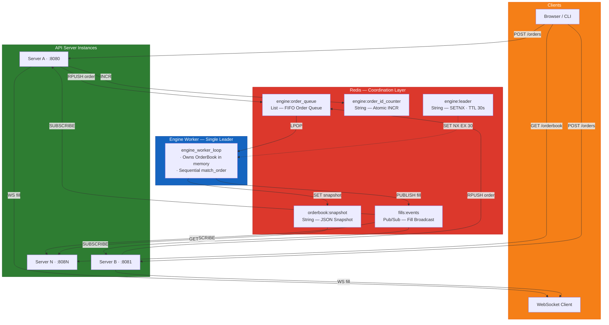
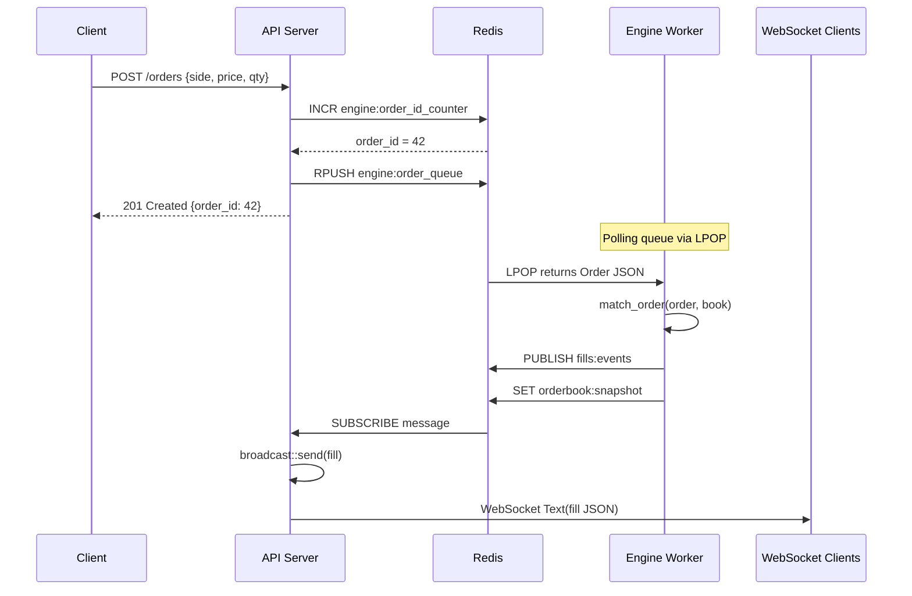
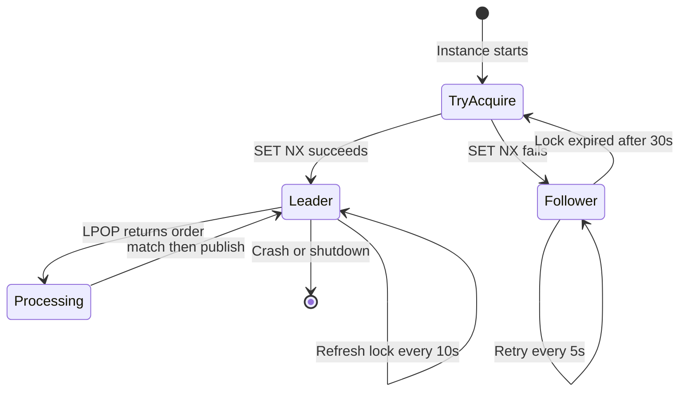
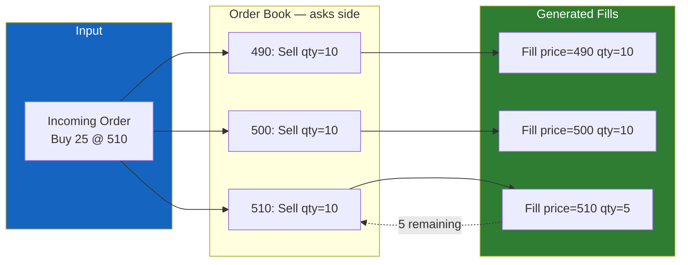

# Matchbox

A toy (but architecturally honest) order matching engine for a prediction market, built in Rust. Designed to demonstrate correctness, clean architecture, and understanding of distributed systems — not feature completeness.

**Stack**: Rust · Tokio · Axum · Redis · WebSockets · serde

---

## Architecture

### System Overview



### Order Lifecycle



### Leader Election and Failover



### Matching Engine — Price-Time Priority



> **Key insight**: All API servers push orders to a shared Redis list. A single engine worker — elected via distributed lock (`SETNX`) — consumes orders sequentially. This eliminates double-matching without distributed consensus.

### How the Flow Works

1. Client sends `POST /orders` to any API server instance
2. API server assigns a globally unique ID via `INCR engine:order_id_counter`
3. API server pushes the serialized order to `engine:order_queue` via `RPUSH`
4. API server immediately returns `201 {order_id}` to the client
5. The engine worker (leader) polls the queue via `LPOP`, deserializes the order
6. Engine runs `match_order()` against the in-memory `OrderBook`
7. Generated fills are published to `fills:events` via Redis Pub/Sub
8. Engine updates the `orderbook:snapshot` in Redis
9. All API server instances receive fills via their Redis subscription
10. Each instance fans out fills to its locally connected WebSocket clients

---

## Prerequisites

- **Rust** (stable, 2021 edition) — [install via rustup](https://rustup.rs/)
- **Redis 7+** — either locally installed or via Docker
- **Docker & Docker Compose** (optional) — for containerized Redis
- **websocat** (optional) — for testing WebSocket feeds (`cargo install websocat`)
- **curl** — for testing HTTP endpoints

---

## Getting Started

### Option A: Manual Setup

**Step 1: Install and start Redis**

```bash
# macOS
brew install redis && redis-server

# Arch Linux
sudo pacman -S redis && sudo systemctl start redis

# Ubuntu/Debian
sudo apt install redis-server && sudo systemctl start redis

# Or use Docker for Redis only
docker run -d --name redis -p 6379:6379 redis:7-alpine
```

**Step 2: Clone and build**

```bash
git clone https://github.com/yashksaini-coder/matchbox.git
cd matchbox
cargo build --workspace
```

**Step 3: Run tests**

```bash
cargo test --workspace
```

**Step 4: Start the server**

```bash
RUST_LOG=info cargo run -p server
```

**Step 5: Verify**

```bash
curl http://localhost:8080/health
# {"status":"ok"}
```

### Option B: Docker Compose

```bash
# Start Redis
docker compose up -d

# Run the server
RUST_LOG=info cargo run -p server

# Verify
curl http://localhost:8080/health

# Teardown
docker compose down
```

### Environment Variables

| Variable | Default | Description |
|----------|---------|-------------|
| `REDIS_URL` | `redis://127.0.0.1:6379` | Redis connection URL |
| `PORT` | `8080` | HTTP server listen port |
| `RUST_LOG` | _(none)_ | Log level filter (e.g., `info`, `debug`) |

---

## API Reference

### POST /orders

Submit a new limit order.

```bash
curl -s -X POST http://localhost:8080/orders \
  -H "Content-Type: application/json" \
  -d '{"side":"buy","price":50,"qty":10}'
```

| Field | Type | Description |
|-------|------|-------------|
| `side` | string | `"buy"` or `"sell"` |
| `price` | u64 | Integer ticks (e.g., 50 = $0.50 if tick = $0.01) |
| `qty` | u64 | Number of contracts (must be > 0) |

**Response** (`201 Created`):

```json
{ "order_id": 1 }
```

**Errors:** `400` (qty=0, price=0) · `422` (invalid JSON/side) · `500` (Redis error)

### GET /orderbook

Return the current order book state.

```bash
curl -s http://localhost:8080/orderbook
```

**Response** (`200 OK`):

```json
{
  "bids": [{ "price": 50, "qty": 30 }],
  "asks": [{ "price": 52, "qty": 15 }],
  "sequence": 42
}
```

- `bids` — sorted highest price first
- `asks` — sorted lowest price first
- `sequence` — increments on every order processed

### GET /ws

WebSocket endpoint. Receives fill events in real time.

```bash
websocat ws://localhost:8080/ws
```

**Fill message:**

```json
{
  "maker_order_id": 1,
  "taker_order_id": 2,
  "price": 50,
  "qty": 10,
  "timestamp": 1711814400000000000
}
```

### GET /health

```bash
curl -s http://localhost:8080/health
# {"status":"ok"}
```

---

## Usage Examples

### Basic Matching

```bash
# Sell 10 at price 50
curl -s -X POST http://localhost:8080/orders \
  -H "Content-Type: application/json" \
  -d '{"side":"sell","price":50,"qty":10}'
# {"order_id":1}

# Buy 10 at price 50 — matches the sell
curl -s -X POST http://localhost:8080/orders \
  -H "Content-Type: application/json" \
  -d '{"side":"buy","price":50,"qty":10}'
# {"order_id":2}

# Book is empty after full match
curl -s http://localhost:8080/orderbook
# {"bids":[],"asks":[],"sequence":2}
```

### Partial Fill

```bash
# Sell 30, then buy 50 — only 30 available
curl -s -X POST http://localhost:8080/orders \
  -H "Content-Type: application/json" \
  -d '{"side":"sell","price":100,"qty":30}'

curl -s -X POST http://localhost:8080/orders \
  -H "Content-Type: application/json" \
  -d '{"side":"buy","price":100,"qty":50}'

curl -s http://localhost:8080/orderbook
# {"bids":[{"price":100,"qty":20}],"asks":[],"sequence":2}
# Fill: qty=30. Remaining 20 rests on bids.
```

### Price Priority

```bash
# Three sells at different prices
curl -s -X POST http://localhost:8080/orders \
  -H "Content-Type: application/json" -d '{"side":"sell","price":490,"qty":10}'
curl -s -X POST http://localhost:8080/orders \
  -H "Content-Type: application/json" -d '{"side":"sell","price":500,"qty":10}'
curl -s -X POST http://localhost:8080/orders \
  -H "Content-Type: application/json" -d '{"side":"sell","price":510,"qty":10}'

# Buy 25 at 510 — fills at 490, 500, then 510 (price priority)
curl -s -X POST http://localhost:8080/orders \
  -H "Content-Type: application/json" -d '{"side":"buy","price":510,"qty":25}'

curl -s http://localhost:8080/orderbook
# {"bids":[],"asks":[{"price":510,"qty":5}],"sequence":4}
```

### WebSocket Feed

```bash
# Terminal 1: Connect WebSocket
websocat ws://localhost:8080/ws

# Terminal 2: Submit crossing orders
curl -s -X POST http://localhost:8080/orders \
  -H "Content-Type: application/json" \
  -d '{"side":"sell","price":60,"qty":5}'
curl -s -X POST http://localhost:8080/orders \
  -H "Content-Type: application/json" \
  -d '{"side":"buy","price":60,"qty":5}'

# Terminal 1 receives the fill JSON in real time
```

---

## Multi-Instance Mode

Supports N API server instances sharing one Redis backend. One instance becomes the engine leader; others serve HTTP/WS and relay fills.

### Running Two Instances

```bash
# Terminal 1: Instance A (becomes leader)
PORT=8080 RUST_LOG=info cargo run -p server

# Terminal 2: Instance B (follower)
PORT=8081 RUST_LOG=info cargo run -p server
```

### Cross-Instance Matching

```bash
# Sell on Instance A, buy on Instance B
curl -s -X POST http://localhost:8080/orders \
  -H "Content-Type: application/json" \
  -d '{"side":"sell","price":50,"qty":10}'

curl -s -X POST http://localhost:8081/orders \
  -H "Content-Type: application/json" \
  -d '{"side":"buy","price":50,"qty":10}'

# Both instances show empty book
curl -s http://localhost:8080/orderbook  # {"bids":[],"asks":[],"sequence":2}
curl -s http://localhost:8081/orderbook  # {"bids":[],"asks":[],"sequence":2}
```

### Leader Failover

1. Kill the leader instance (Ctrl+C)
2. Wait ~30 seconds (lock TTL expires)
3. The surviving instance logs `Became engine leader`
4. Submit new orders — processed by the new leader

During failover, orders queue in Redis and are **not lost**.

---

## Running Tests

```bash
# All tests
cargo test --workspace

# Engine tests only
cargo test -p engine

# Specific test
cargo test -p engine test_price_priority

# With output
cargo test --workspace -- --nocapture
```

### Test Coverage

| Test | Verifies |
|------|----------|
| `test_no_match_rests_on_book` | Sell into empty book rests on asks |
| `test_full_match` | Exact crossing match, both consumed |
| `test_partial_fill_incoming_larger` | Incoming > resting, remainder rests |
| `test_partial_fill_resting_larger` | Incoming < resting, resting reduced |
| `test_price_priority` | Best price matched first across levels |
| `test_time_priority` | FIFO ordering at the same price |
| `test_fills_sum_to_matched_qty` | Fill quantities sum correctly |
| `test_no_match_price_too_low` | Buy below ask, both rest |
| `test_sell_matches_highest_bid_first` | Highest bid fills first |

### Code Quality

```bash
cargo clippy --all-targets -- -D warnings
cargo fmt --all -- --check
```

---

## Project Structure

```
matchbox/
├── Cargo.toml              # Workspace definition
├── Cargo.lock
├── README.md
├── docker-compose.yml      # Redis service
├── .gitignore
├── .github/
│   └── workflows/
│       └── docs.yml        # CI: build & deploy docs to GitHub Pages
├── book/                   # mdBook documentation site source
│   ├── book.toml
│   └── src/
├── postman/                # Postman API collection
│   └── Matchbox.postman_collection.json
│
└── crates/
    ├── engine/             # Core matching engine (pure Rust, no I/O)
    │   ├── Cargo.toml
    │   └── src/
    │       ├── lib.rs          # Module re-exports
    │       ├── models.rs       # Order, Fill, Side, request/response types
    │       ├── book.rs         # OrderBook (BTreeMap + VecDeque)
    │       └── matcher.rs      # match_order() + unit tests
    │
    └── server/             # API server binary (Axum + Redis + WS)
        ├── Cargo.toml
        └── src/
            ├── main.rs             # Entry point, startup sequence
            ├── state.rs            # AppState (Redis, broadcast, instance ID)
            ├── errors.rs           # AppError enum
            ├── engine_worker.rs    # LPOP loop + matching + leader election
            ├── redis_sub.rs        # Pub/Sub subscriber -> broadcast
            └── routes/
                ├── mod.rs          # Router definition
                ├── orders.rs       # POST /orders, GET /orderbook
                └── ws.rs           # GET /ws WebSocket handler
```

### Module Responsibilities

| Module | Responsibility |
|--------|---------------|
| `engine::models` | Domain types: Order, Fill, Side, snapshots |
| `engine::book` | OrderBook: BTreeMap storage, add/query/snapshot |
| `engine::matcher` | Price-time priority matching algorithm |
| `server::main` | Tokio runtime, Redis init, Axum serve, task spawning |
| `server::state` | AppState shared across all handlers |
| `server::engine_worker` | Leader election + order queue consumer |
| `server::redis_sub` | Redis Pub/Sub -> tokio broadcast bridge |
| `server::routes::orders` | Order submission and book query handlers |
| `server::routes::ws` | WebSocket upgrade and fill streaming |

### Redis Key Namespace

| Key | Type | Purpose | TTL |
|-----|------|---------|-----|
| `engine:order_id_counter` | String (int) | Monotonically increasing order ID via INCR | None |
| `engine:order_queue` | List | FIFO queue of serialized orders (RPUSH/LPOP) | None |
| `engine:leader` | String | Engine leader instance ID (SET NX EX) | 30s |
| `orderbook:snapshot` | String (JSON) | Latest order book snapshot | None |
| `fills:events` | Pub/Sub | Fill event broadcast | N/A |

---

<div align="center">

[](https://www.yashksaini.systems/)
[](https://www.linkedin.com/in/yashksaini/)
[](https://x.com/0xCracked_dev)
[](https://github.com/yashksaini-coder)

</div>