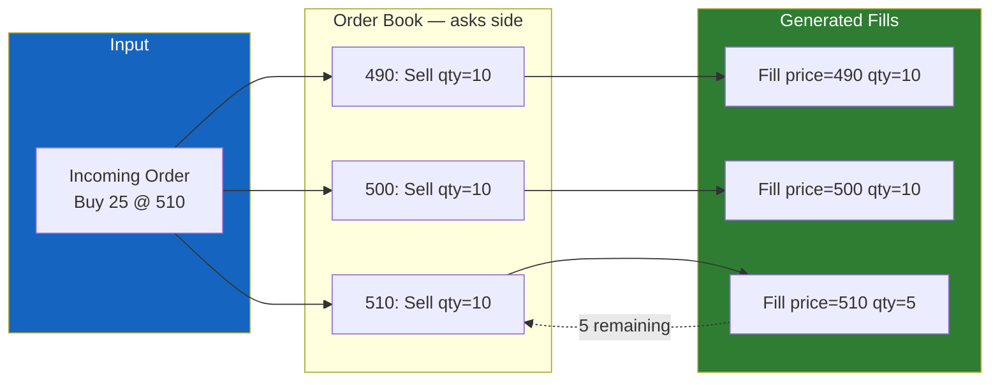
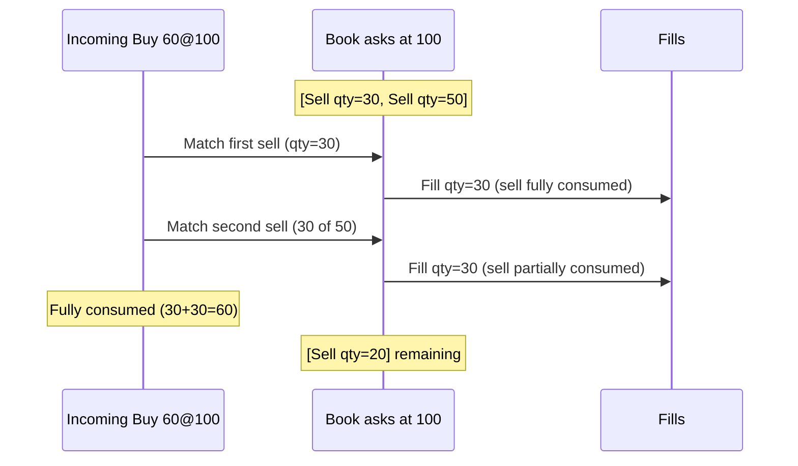

# Matching Engine

The matching engine lives in `crates/engine/` — a pure Rust library with zero I/O dependencies.

## Price-Time Priority

The algorithm used by every major exchange (NASDAQ, CME, Binance, Polymarket):

1. **Price first** — for a buy, match the lowest ask. For a sell, match the highest bid.
2. **Time second** — at the same price, the earlier order matches first.
3. **Maker price** — fills execute at the resting (maker) order's price, not the taker's.

## The Core Function

```rust
pub fn match_order(mut incoming: Order, book: &mut OrderBook) -> Vec<Fill> {
    let mut fills = Vec::new();

    match incoming.side {
        Side::Buy  => match_buy(&mut incoming, book, &mut fills),
        Side::Sell => match_sell(&mut incoming, book, &mut fills),
    }

    // Unfilled remainder rests on the book
    if incoming.qty > 0 {
        book.add_resting_order(incoming);
    }

    book.sequence += 1;
    fills
}
```

Takes an `Order` and a mutable `OrderBook`. Returns fills. The book is mutated in place. No I/O, no async, no Redis — pure computation.

## How match_buy Works

```rust
while incoming.qty > 0 {
    let best_ask_price = match book.best_ask() {
        Some(p) => p,
        None => break,       // No sellers
    };

    if incoming.price < best_ask_price {
        break;               // Price too low
    }

    // Walk the price level FIFO, filling orders
    // ...
}
```

The sell-side (`match_sell`) is symmetric — matches against highest bids first.

## Price Priority in Action



## Partial Fills

When an incoming order is larger than available liquidity:



## Test Coverage

```bash
$ cargo test -p engine
running 9 tests
test test_no_match_rests_on_book       ... ok
test test_full_match                   ... ok
test test_partial_fill_incoming_larger ... ok
test test_partial_fill_resting_larger  ... ok
test test_price_priority               ... ok
test test_time_priority                ... ok
test test_fills_sum_to_matched_qty     ... ok
test test_no_match_price_too_low       ... ok
test test_sell_matches_highest_bid_first ... ok
```
