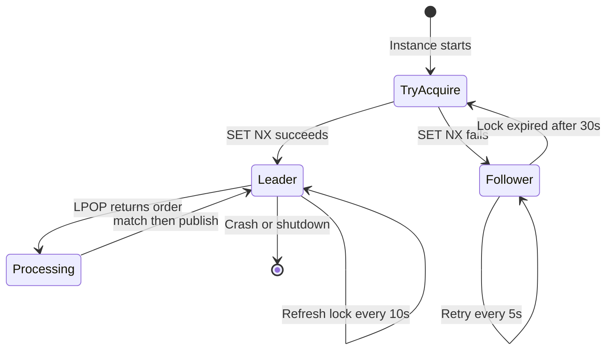
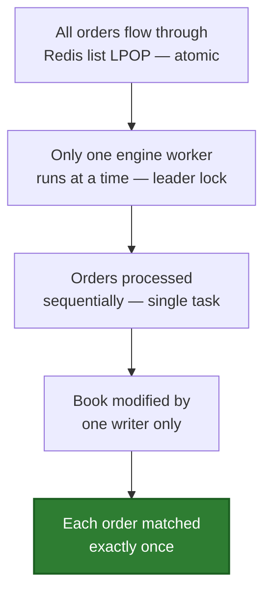

# Multi-Instance Design

The hardest problem in this project: N server instances sharing one order book without double-matching.

## Leader Election

On startup, every instance tries to claim the engine leader lock:

```rust
const LEADER_KEY: &str = "engine:leader";
const LEADER_TTL_SECS: i64 = 30;

async fn try_become_leader(redis: &Client, instance_id: &str) -> bool {
    redis.set::<(), _, _>(
        LEADER_KEY,
        instance_id,
        Some(Expiration::EX(LEADER_TTL_SECS)),  // Expires in 30s
        Some(SetOptions::NX),                     // Only if key doesn't exist
        false,
    ).await.is_ok()
}
```

`SET NX EX` is atomic — exactly one instance wins. Others retry every 5 seconds.

## Lock Refresh

The leader refreshes its lock every 10 seconds using an atomic Lua script:

```rust
let script = r#"
    if redis.call('get', KEYS[1]) == ARGV[1] then
        return redis.call('expire', KEYS[1], ARGV[2])
    else
        return 0
    end
"#;
```

This prevents a stale leader from accidentally extending a lock that another instance already acquired.

## Failover



During the failover window (~30s), orders queue up in Redis but are **not lost**. The new leader processes them in FIFO order.

**Known limitation:** The in-memory order book is lost when the leader crashes. A production system would reconstruct it from a persistent fill log.

## Correctness Guarantee


