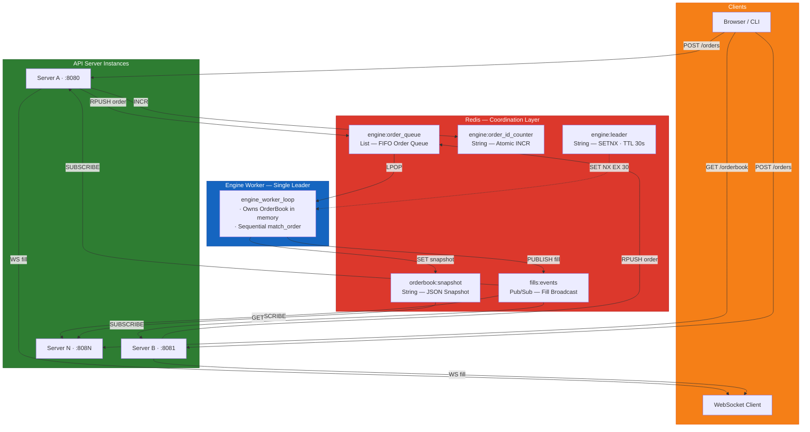
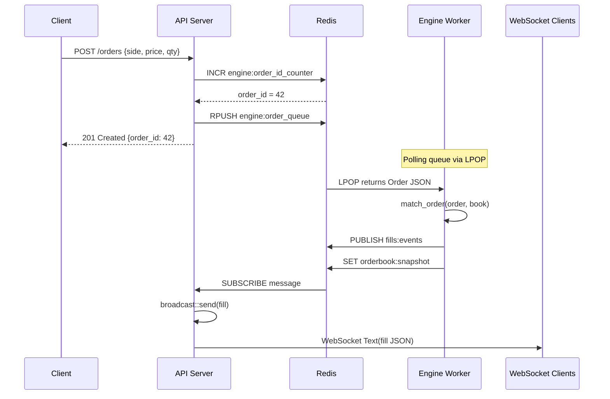

# System Overview

Matchbox uses a **Single Writer** architecture. All API servers push orders into a shared Redis queue. One elected engine worker consumes orders sequentially and publishes fills.

## Component Diagram

## Order Lifecycle

## Why Single Writer?

The core problem: if two servers match orders against the same book simultaneously, a resting order can be consumed twice (double-fill).

The single writer eliminates this by construction — one task, one book, sequential processing. Redis queue serializes all incoming orders. No locks, no CAS retry loops, no distributed consensus.

| Approach | Correctness | Complexity | Chosen? |
|----------|-------------|------------|---------|
| Single Writer (Redis Queue) | Correct by construction | Simple | **Yes** |
| Optimistic Locking (CAS) | Correct with retries | Moderate | No |
| Raft Consensus | Strongly consistent | Very high | No |
