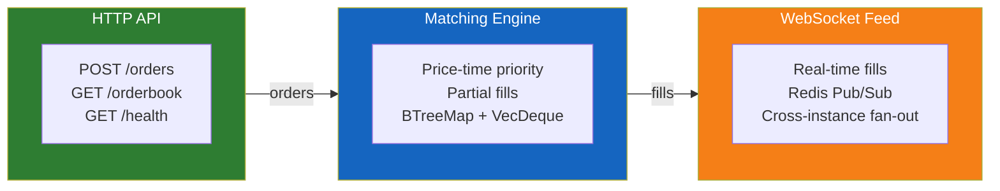

# Matchbox

**A prediction market order matching engine built in Rust.**

Matchbox is a toy (but architecturally honest) system that demonstrates how to build a correct, distributed order matching engine. It supports multiple API server instances running simultaneously without double-matching orders.

## The Three Pillars



| Pillar | What It Does |
|--------|-------------|
| **HTTP API** | Submit orders, query the order book |
| **Matching Engine** | Price-time priority matching with partial fills |
| **WebSocket Feed** | Real-time fill events broadcast to all clients |

## Tech Stack

```
Rust        — Systems language, memory-safe, zero-cost abstractions
Tokio       — Async runtime for concurrent I/O
Axum        — HTTP framework with WebSocket support
Redis       — Coordination layer (queue, Pub/Sub, leader lock)
serde       — JSON serialization
```

## Project Layout

```
matchbox/
├── crates/
│   ├── engine/          # Pure matching logic (no I/O)
│   │   └── src/
│   │       ├── models.rs    # Order, Fill, Side types
│   │       ├── book.rs      # OrderBook (BTreeMap + VecDeque)
│   │       └── matcher.rs   # match_order() + tests
│   └── server/          # API server (Axum + Redis + WS)
│       └── src/
│           ├── main.rs          # Entry point
│           ├── engine_worker.rs # Queue consumer + matching
│           ├── redis_sub.rs     # Pub/Sub → broadcast
│           └── routes/          # HTTP + WS handlers
├── docker-compose.yml
└── README.md
```

## Design Philosophy

The codebase is ~867 lines of Rust across 12 source files. The guiding principle: **every line earns its place**. Features that don't serve correctness or architectural clarity were intentionally omitted — no auth, no persistence, no complex order types.

The `engine` crate has zero I/O dependencies. It is a pure function: `(Order, &mut OrderBook) → Vec<Fill>`. This makes it trivially testable and completely decoupled from networking, storage, or serialization concerns.
