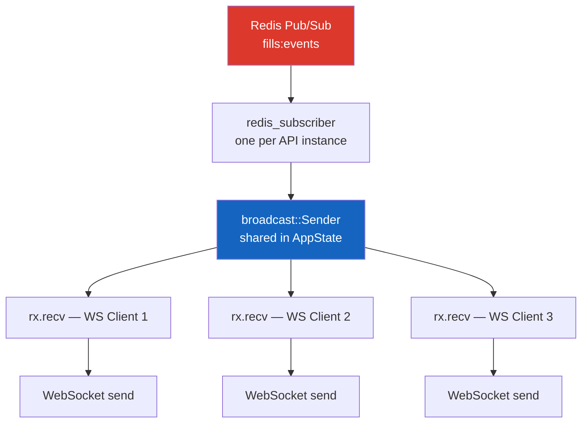

# WebSocket Feed

Clients connect to `GET /ws` and receive fill events in real time across all server instances.

## How It Works



## Server-Side Handler

The key pattern: subscribe to the broadcast channel **before** the WebSocket upgrade to avoid missing fills during the handshake.

```rust
pub async fn ws_handler(
    ws: WebSocketUpgrade,
    State(state): State<AppState>,
) -> Response {
    let rx = state.fills_tx.subscribe(); // Subscribe BEFORE upgrade
    ws.on_upgrade(|socket| handle_socket(socket, rx))
}
```

Each socket runs two concurrent tasks via `tokio::select!`:

```rust
// Task 1: broadcast → WebSocket (send fills to client)
// Task 2: WebSocket → drain (detect disconnection)
tokio::select! {
    _ = &mut send_task => recv_task.abort(),
    _ = &mut recv_task => send_task.abort(),
}
```

## Cross-Instance Fan-Out

When the engine worker (on Instance A) publishes a fill to Redis Pub/Sub, **every** API instance receives it and forwards to their local WebSocket clients. A client connected to Instance B sees fills generated by Instance A.

## Connecting

```bash
# Using websocat
websocat ws://localhost:8080/ws

# Using wscat
wscat -c ws://localhost:8080/ws

# Programmatically (JavaScript)
const ws = new WebSocket("ws://localhost:8080/ws");
ws.onmessage = (e) => console.log(JSON.parse(e.data));
```
